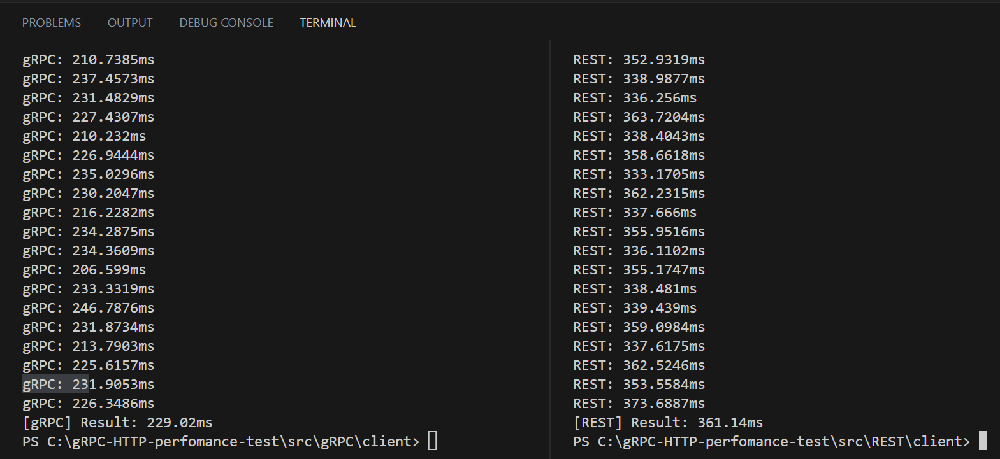

# gRPC-HTTP-perfomance-test

### As you could see the result of the experiment is that REST is slower than gRPC as minimum 1.5 times, as maximum - 2 times.
- REST - 229.02ms avg time to make 1000 requests
- gRPC - 361.14ms avg time to make 1000 requests

